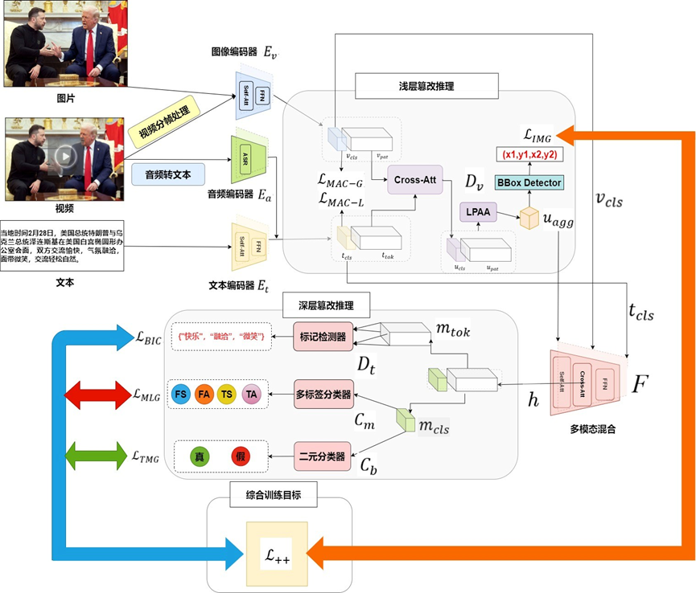

**STRIKE：面向多模态AI生成内容的零样本检测与隐私保护研究**

**如果您发现这项工作对您的研究有用，请收藏我们的存储库。**

**介绍**

本系统的核心是一个基于分层推理的多模态Transformer框架，能够处理图像、文本、视频和音频等多模态数据，并通过全局、局部与细粒度特征对齐，实现稳健的篡改检测与可解释分析。该框架包含多模态生成内容检测、零样本流形检测和联邦学习三个核心模块，分别面向篡改识别、未见类型泛化和多源协同训练下的隐私保护。

随着多模态AI生成技术的快速发展，内容安全问题日益凸显。现有检测方法主要面临三大挑战：其一，单模态检测难以应对图文音视频的协同伪造。其二，生成模型迭代快，检测器泛化能力不足。其三，集中式架构依赖数据集中上传，存在隐私泄露风险。 针对上述问题，研究提出并实现了统一的多模态检测系统STRIKE。针对上述问题，研究提出一种自适应、隐私保护的多模态AI生成内容检测系统。首先，设计基于分层推理的多模态语义对齐机制，构建图文共享嵌入空间，通过一致性评分识别语义偏差，增强多模态伪造检测能力。其次，提出一种零样本流形检测方法，利用预训练模型提取的通用表征，在无需目标生成模型训练数据的条件下实现多模型泛化识别。最后，构建基于安全聚合的联邦学习架构，客户端本地更新检测模型，服务器端聚合梯度，通过加密的模型参数更新进行知识共享，实现在不接触原始数据前提下的协同建模。

研究构建了多模态新闻伪造检测数据集 MMNF（Multimodal Media News Forensics）

所提出的STRIKE系统框架如下：

**安装环境**

**	我们建议使用 Anaconda 来管理 python 环境：**

conda create -n STRIKE python=3.8

conda activate STRIKE

conda install --yes -c pytorch pytorch=1.10.0 torchvision==0.11.1 cudatoolkit=11.3

pip install -r requirements.txt

conda install -c conda-forge ruamel_yaml

**数据集准备**

该数据集来源于多家国际主流新闻媒体（如 The Guardian、BBC News、USA Today、The Washington Post），并参考了新媒体平台（如 TikTok、X、Facebook）的公开内容，采集了大量图像（视频）—文本配对数据，从而在语境与表达方式上具备高度多样性。

我们呈现DGM4，一个用于研究机器生成的多模态媒体作的大规模数据集。考虑到其巨大的公众影响力，该数据集特别关注以人为本的新闻。 我们基于 [VisualNews](https://github.com/FuxiaoLiu/VisualNews-Repository) 数据集开发数据集，共形成 24000个实例样本，包括77,426个原始图像-文本对和152,574个经过处理的对。 纵的对包含：

66,722次换脸篡改 （基于[SimSwap](https://github.com/neuralchen/SimSwap) 和[InfoSwap](https://github.com/GGGHSL/InfoSwap-master))

56,411次人脸属性篡改 （基于[HFGI](https://github.com/Tengfei-Wang/HFGI) 和[StyleCLIP](https://github.com/orpatashnik/StyleCLIP))

43,546次文本交换篡改（使用 Flair 和 [Sentence-BERT](https://github.com/UKPLab/sentence-transformers))

19,688次文本属性篡改（基于 Flair)

9671次音频语义篡改（VITS）

其中 1/3 的被处理图像和 1/2 的被处理文本组合在一起形成 32,693 个混合处理对。

以下是统计数据和一些示例图像-文本对：

**原始**

**篡改**

**原始**

**篡改**

**换脸篡改**

**一名枪手从集会高处向男子演讲台开了数枪，子弹击中该男子右耳，男子满脸是血，随即撤离了演讲台。         **

**一名枪手从集会高处向男子演讲台开了数枪，子弹击中该男子右耳，男子满脸是血，随即撤离了演讲台。         **

**刘德华，1961年9月27日出生于中国香港，是一名著名的男演员、歌手 、制片人和作词人。  **

**          **

**刘德华，1961年9月27日出生于中国香港，是一名著名的男演员、歌手 、制片人和作词人。  **

**          **

**人脸属性篡改**

**成龙穿着浅色外套，双手放在头上，表情显得有些困惑与惊讶。**

**          **

**成龙穿着浅色外套，双手放在头上，表情显得有些困惑与惊讶。**

**          **

**甲亢哥的笑容感染力十足，给人一种积极向上、乐观开朗的感觉。**

**甲亢哥的笑容感染力十足，给人一种积极向上、乐观开朗的感觉。**

**文本替换篡改**

**京东老总刘强东请京东外卖骑手吃火锅。 **

**          **

**厨师刘强东向骑手 “徒弟” 传授火锅秘籍。**

**          **

**钟南山院士接受记者采访，强调疫情期间戴口罩、勤洗手、讲卫生的重要性。**

**          **

**“著名教练钟南山，正接受采访复盘赛事，他强调：球员要是都像我戴这眼镜，防守时眼神绝对犀利，对方想传球都难！”**

**          **

**文本属性篡改**

**何炅觉得黄磊的这碗米稀不好吃。**

**          **

**何炅觉得黄磊的这碗米稀很好吃。**

**          **

**钢琴家郎朗很享受弹奏钢琴时的快乐。**

**          **

**钢琴家郎朗不享受弹奏钢琴时的快乐。**

**          **

**音频语义篡改**

**每次比赛，我都会全力以赴去接球。  **

**          **

**每场比赛，我都不尽力接球，早早收工离开。**

**          **

**梅拉尼娅，他们俩是我的好朋友克林顿和希拉里。**

**          **

**梅拉尼娅，他们俩是我的仇人克林顿和希拉里。**

**          **

**人脸+文本篡改**

**钢铁侠扮演者是美国的小罗伯特唐尼。**

**          **

**钢铁侠扮演者是美国的埃隆马斯克。**

**          **

**两个儿子的离世一直困扰着Rafat和Ferial。**

**          **

**两个儿子的爱一直鼓励着Rafat和Ferial。**

**          **

**人脸+音频语义篡改**

**我和郭德纲是多年的相声搭档，主持过很多相声演出。**

**          **

**我和赵本山是多年的相声搭档，主持过很多相声演出。**

**          **

**这一别，不知何日才能归来，心中满是离愁。**

**          **

**这一别，不问归期，只享受离家的自由与欢乐。**

**          **

图2.2  MMNF数据集实例样本

**可视化结果**

